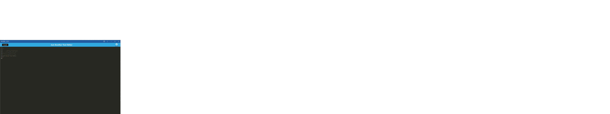

# Just Another Text Editor

## Description

This is just another javascript text editor which can be installed as a pwa

## Table of Contents

- [Installation](#installation)
- [Usage](#usage)
- [License](#license)
- [Contributing](#contributing)
- [Tests](#tests)
- [Questions](#questions)

## Installation

click the install button then click install again on the prompt

## Usage

it acts as a simple text editor for writing javascript

## License

https://opensource.org/licenses/MIT

This project is licensed under the MIT License.

## Contributing

n/a

## Screenshot

## Questions

If you have any questions about this project, you can reach me at orion.m.cannon@gmail.com
or you can find me on GitHub at [OrionC11](https://github.com/OrionC11).
